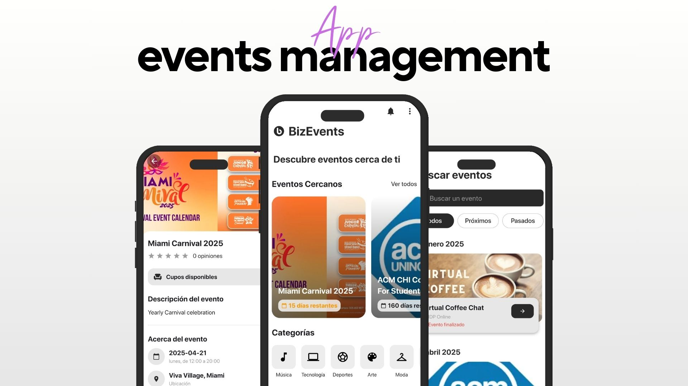

# Event Management Application

 

## Overview

The Event Management Application is a Flutter-based mobile app designed for managing events. The app allows users to browse event tracks, subscribe to specific events, track past and upcoming events, and provide anonymous feedback on attended events. It also supports offline functionality by caching event data using SQLite. 


## Features

- **Offline Support & Smart Data Fetching**:
  - Event data is cached locally using SQLite or Hive.
  - A version check API ensures that the app fetches new data only if an update is available.

- **Event Management**:
  - The app allows browsing event tracks and subscribing to events.
  - Each event has details such as name, location, date & time, maximum number of participants, and description.

- **Event Subscription**:
  - Users can subscribe to events if there are available spots.
  - The event details page shows the number of available spots.
  - Users can view their subscribed events, with color-coding for upcoming and past events.

- **Anonymous Event Feedback**:
  - Users can provide feedback on events with a 5-star rating and text comments.
  - Feedback remains anonymous, and the backend aggregates ratings to show an average score for each event.

## Technology Stack

- **Flutter**: The app is built using Flutter as the primary development framework.
- **SQLite/Hive**: For offline data caching.
- **State Management**: The app uses **GetX** (or **Provider**) for state management.
- **Backend API**: A backend API defines event tracks and manages subscriptions and feedback.

## Installation

### Prerequisites

Make sure you have the following installed:

- [Flutter SDK](https://flutter.dev/docs/get-started/install)
- [Android Studio](https://developer.android.com/studio) or any other IDE with Flutter support
- [Xcode](https://developer.apple.com/xcode/) (for macOS users)

### Steps to Run the Project

1. Clone the repository:

```bash
git clone https://github.com/antonyjdc/conference-management-app.git
cd conference-management-app
```

2. Install dependencies:

```bash
flutter pub get
```

3. Run the app on an emulator or device:

```bash
flutter run
```

## App Architecture
### Main Features:

- Event Tracks: List of available conference tracks.

- Event Details: Each event page has subscribe/unsubscribe functionality, event details, and a feedback section.

- Subscribed Events: Users can see their subscribed events categorized by upcoming and past events.

### State Management:

- The app uses GetX (or Provider) for managing the state of event subscriptions, feedback, and data fetching.

### Database: Event data is cached locally using SQLite or Hive to ensure offline functionality.

- Navigation: The app has a navigation bar for browsing: Event Lines, Subscribed Events, Search and Calendar

# Demostration Video
<video width="640" height="360" controls>
  <source src="assets/videos/video_demo.mp4" type="video/mp4">
</video>
